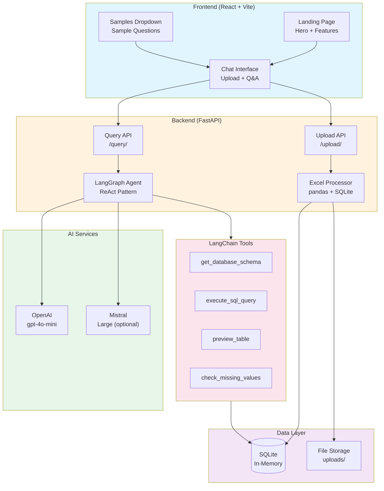

# Technical Documentation - AskMyDoc

**Version:** 2.1.0  
**Date:** December 2024  
**Status:** Stable with Comprehensive Test Coverage (Pre‑Production)

---

## 1. Architecture Overview

### System Architecture

AskMyDoc is a full-stack AI-powered document assistant that enables natural language querying of Excel data. The system employs a modern three-tier architecture with a thin React frontend, a FastAPI backend responsible for orchestration and data processing, and an AI layer (LangChain + LangGraph + OpenAI) that handles reasoning and tool invocation.

#### 1.1 Frontend Layer (React + Vite)
- **Landing Page**: Beautiful, animated hero section with smooth transitions
- **Chat Interface**: ChatGPT-style conversational UI with integrated file upload
- **Sample Questions Dropdown**: Pre-populated questions for user guidance
- **Real-time Feedback**: Loading states, progress indicators, error messages
- **Modern UX**: Gradients, animations, hover effects for premium feel

#### 1.2 Backend Layer (FastAPI + Python)
- **REST API**: FastAPI-based async HTTP endpoints (`/upload`, `/query`, `/health`)
- **Excel Processor**: `pandas` + `openpyxl` for file parsing and SQLite table creation
- **AI Agent Orchestrator**: LangGraph-based ReAct agent with tool usage
- **Database**: In-memory SQLite for fast, ephemeral querying
- **Configuration**: Pydantic `BaseSettings` + `.env` (keys such as `OPENAI_API_KEY`)
- **Logging**: Rich library for structured, colorized console output

#### 1.3 AI Layer (LangChain + LLMs)
- **Primary Model**: OpenAI `gpt-4o-mini` (default), configured via `OPENAI_API_KEY` in `backend/.env`
- **Optional Model**: Mistral (`mistral-large-latest`) path wired but disabled unless `MISTRAL_API_KEY` is provided
- **Tool System**: Four specialized tools (`get_database_schema`, `execute_sql_query`, `preview_table`, `check_missing_values`)
- **ReAct Pattern**: Reasoning and Acting loop for multi-step queries over SQL + tools
- **State Management**: LangGraph `StateGraph` for the agent workflow and tool transitions

### Architecture Diagram (Conceptual)



### Data Flow

```
┌─────────────────────────────────────────────────────────┐
│ 1. File Upload Flow                                     │
├─────────────────────────────────────────────────────────┤
│ User selects files → Frontend Upload                    │
│         ↓                                               │
│ POST /upload/ → FastAPI Endpoint                        │
│         ↓                                               │
│ Excel Processor reads sheets                            │
│         ↓                                               │
│ DataFrame → SQLite tables (in-memory)                   │
│         ↓                                               │
│ Return: {tables_created, row_count, status}             │
└─────────────────────────────────────────────────────────┘

┌─────────────────────────────────────────────────────────┐
│ 2. Query Flow                                           │
├─────────────────────────────────────────────────────────┤
│ User asks question → Chat Interface                     │
│         ↓                                               │
│ POST /query/ → FastAPI Endpoint                         │
│         ↓                                               │
│ LangGraph Agent receives question                       │
│         ↓                                               │
│ Agent uses tools:                                       │
│   - get_database_schema (understand data)               │
│   - execute_sql_query (run SQL)                         │
│   - check_missing_values (data quality)                 │
│         ↓                                               │
│ LLM (OpenAI/Mistral) generates response                 │
│         ↓                                               │
│ Return: {answer, sql_queries, model}                    │
└─────────────────────────────────────────────────────────┘
```

---

## 2. Current Capabilities

### 2.1 File Processing ✅
- ✅ **Multi-file upload**: Handles multiple Excel files simultaneously
- ✅ **Multi-sheet support**: Reads all sheets from each workbook
- ✅ **Automatic table naming**: `filename_sheetname` convention
- ✅ **Schema extraction**: Auto-detects columns, types, row counts
- ✅ **Format support**: `.xlsx` and `.xls` files
- ✅ **Progress indicators**: Real-time upload feedback
- ✅ **Error handling**: Validates file types and handles corrupted files

### 2.2 Natural Language Question Answering ✅
- ✅ **Aggregations**: SUM, AVG, COUNT, GROUP BY operations
- ✅ **Comparisons**: Time period comparisons, category comparisons
- ✅ **Rankings**: TOP N queries, sorting, ordering
- ✅ **Data Quality**: Missing value detection, inconsistency checks
- ✅ **Multi-table queries**: Joins across uploaded files
- ✅ **SQL transparency**: Shows generated SQL queries
- ✅ **Model switching**: OpenAI GPT-4 or Mistral Large

### 2.3 AI Agent Features ✅
- ✅ **ReAct Pattern**: Reasoning before action for tool selection and query planning
- ✅ **Multi-step queries**: Combines multiple tools for complex questions over multiple files
- ✅ **Tool usage**: 4 specialized tools (schema, SQL, preview, missing values)
- ✅ **Error recovery**: Basic retries on SQL errors, with logging and partial results when possible
- ✅ **State management**: LangGraph `StateGraph` for workflow and transitions between model ↔ tools


### 2.4 User Interface ✅
- ✅ **Beautiful landing page**: Animated hero section with gradient backgrounds
- ✅ **ChatGPT-style interface**: Familiar conversational UX
- ✅ **Integrated file upload**: 📎 button in chat input
- ✅ **Sample questions dropdown**: 💡 button with 4 example queries
- ✅ **Message types**: User, AI, System, Error with distinct styling
- ✅ **Responsive design**: Works on desktop and tablet
- ✅ **Smooth animations**: Fade-ins, slide-ins, floating cards
- ✅ **Loading states**: Spinners during upload and query processing

### 2.5 Testing & Quality Assurance ✅
- ✅ **Integration test suite**: 5 comprehensive test cases
- ✅ **Baseline capture**: All tests passing (100% success rate)
- ✅ **Test automation**: pytest-based test runner
- ✅ **Test data**: Organized in `tests/excels/` with 5 scenarios
- ✅ **Continuous validation**: Run tests before deployment

**Test Coverage:**
1. Q1: Total revenue by country (multi-file aggregation)
2. Q2: Highest margin product (comparative analysis)
3. Q3: Q1 vs Q2 sales (time period comparison)
4. Q4: Top 5 customers (ranking query)
5. Q5: Missing values (data quality check)

### 2.6 Monitoring & Observability ✅
- ✅ **Rich console logs**: Color-coded, formatted output
- ✅ **Progress indicators**: Spinners for long-running operations

- ✅ **Action logging**: Every step logged (upload, query, tool use)
- ✅ **Error tracking**: Detailed error messages with stack traces

---

## 3. Limitations and What is NOT Implemented

### 3.1 Data Persistence ❌
- ❌ **No permanent storage**: Database is in-memory (`:memory:`)
- ❌ **No user sessions**: No authentication or user management
- ❌ **Data loss on restart**: All uploaded data lost when server restarts
- ❌ **No file history**: Cannot view previously uploaded files

### 3.2 Scalability ❌
- ❌ **Single-threaded processing**: Large files block the server
- ❌ **Memory constraints**: Files >50MB may cause crashes
- ❌ **No query caching**: Repeated queries re-execute
- ❌ **No horizontal scaling**: Single server instance only

### 3.3 Security ❌
- ❌ **No authentication**: Open API, anyone can access
- ❌ **No authorization**: No role-based access control
- ❌ **No rate limiting**: Vulnerable to API abuse
- ❌ **No input sanitization**: Limited SQL injection protection
- ❌ **No HTTPS**: HTTP only (no TLS/SSL)
- ❌ **No file scanning**: No virus/malware detection

### 3.4 AI Capabilities ❌
- ❌ **No streaming**: Batch responses only, no token streaming
- ❌ **No visualization**: Cannot generate charts or graphs
- ❌ **No file editing**: Read-only, cannot modify Excel files
- ❌ **No export**: Cannot export answers as PDF/Excel
- ❌ **No custom prompts**: Fixed system prompts

### 3.5 Frontend ❌
- ❌ **No mobile optimization**: Desktop-focused UI
- ❌ **No dark mode**: Light theme only
- ❌ **No file preview**: Cannot view Excel content before querying
- ❌ **No conversation history**: Chat resets on page refresh
- ❌ **No copy/paste**: No easy way to copy answers

### 3.6 Advanced Features ❌
- ❌ **No time series analysis**: Limited temporal query support
- ❌ **No predictive analytics**: No ML models beyond LLM
- ❌ **No pivot tables**: No dynamic data reshaping
- ❌ **No formula evaluation**: Cannot parse Excel formulas
- ❌ **No multi-user collaboration**: Single-user only

---

## 4. Failure Modes

### 4.1 Common Failure Scenarios

| Failure Mode | Trigger | Symptom | User Impact | Mitigation |
|--------------|---------|---------|-------------|------------|
| **Upload Failure** | Invalid file format | "Invalid file type" error | Cannot upload files | Use `.xlsx` or `.xls` only |
| **Memory Overflow** | File >50MB | Server crash / 500 error | Service unavailable | Limit file size |
| **Query Timeout** | Complex multi-table join | No response after 60s | User frustration | Simplify question |
| **SQL Error** | Invalid column name | "SQL execution error" | Incorrect answer | Check schema first |
| **API Key Invalid** | Expired/wrong key | 401 Unauthorized | No AI responses | Update config.py |
| **Model Hallucination** | Ambiguous question | Plausible but wrong answer | Data misinterpretation | Ask more specific questions |
| **Connection Lost** | Backend offline | "Network Error" in UI | Cannot use app | Restart backend |
| **Race Condition** | Multiple uploads | Data from wrong file | Incorrect results | Upload one at a time |
| **LLM Rate Limit** | Too many requests | 429 Too Many Requests | Service degradation | Wait and retry |

### 4.2 Error Handling Strategy

**Frontend:**
- Displays user-friendly error messages
- Retries failed requests (3 attempts max)
- Validates file types before upload
- Shows loading states during processing

**Backend:**
- Structured error responses (JSON with `detail` field)
- Try-catch blocks around critical operations
- Logs all errors with Rich formatting
- Returns appropriate HTTP status codes (400, 500, etc.)

**AI Agent:**
- Catches tool execution errors
- Retries with different strategy on SQL errors
- Graceful degradation (partial answers if possible)
- Logs all tool calls and errors

### 4.3 Data Loss Scenarios

| Scenario | Probability | Impact | Recovery |
|----------|-------------|--------|----------|
| Server restart | Medium | Total data loss | Re-upload files |
| Memory overflow | Low | Server crash | Restart server |
| Browser refresh | High | Chat history lost | N/A (expected) |
| Network failure | Medium | Request lost | Retry upload/query |

---

## 5. Productionization Roadmap

### Phase 1: Data Persistence & Security (3–4 days)

#### 5.1 Database Migration (1.5 days)
**Current:** SQLite in-memory  
**Target:** PostgreSQL with persistent storage

**Tasks:**
- Set up PostgreSQL instance (local/cloud)
- Implement database migrations (Alembic)
- Add connection pooling (SQLAlchemy)
- Migrate table creation logic
- Add database cleanup jobs
- **Estimate**: 1.5 days

#### 5.2 File Storage (1 day)
**Current:** Local uploads/ directory  
**Target:** Cloud storage (AWS S3 / Google Cloud Storage)

**Tasks:**
- Implement S3/GCS client
- Add file upload to cloud
- Add file versioning
- Implement signed URLs for download
- **Estimate**: 1 day

#### 5.3 Authentication & Authorization (1.5 days)
**Current:** Open API  
**Target:** JWT-based auth with user roles

**Tasks:**
- Implement user registration/login
- Add JWT token generation/validation
- Create user roles (admin, user, guest)
- Protect API endpoints
- Add password hashing (bcrypt)
- **Estimate**: 1.5 days

**Phase 1 Total**: 4 days

---

### Phase 2: Performance & Reliability (3–4 days)

#### 5.4 Caching Layer (1 day)
**Current:** No caching  
**Target:** Redis for query result caching

**Tasks:**
- Set up Redis instance
- Cache LLM responses (by question hash)
- Cache SQL query results
- Implement cache invalidation logic
- **Estimate**: 1 day

#### 5.5 Async Processing (1.5 days)
**Current:** Synchronous file processing  
**Target:** Background job queue (Celery + Redis)

**Tasks:**
- Set up Celery workers
- Implement async file upload processing
- Add job status tracking
- WebSocket for progress updates
- **Estimate**: 1.5 days

#### 5.6 Error Recovery & Resilience (1 day)
**Current:** Basic try-catch  
**Target:** Comprehensive retry logic

**Tasks:**
- Add exponential backoff for LLM calls
- Implement circuit breakers for external APIs
- Add health checks
- Graceful degradation strategies
- **Estimate**: 1 day

#### 5.7 Monitoring & Alerting (0.5 day)
**Current:** Langfuse only  
**Target:** Full observability stack

**Tasks:**
- Add Prometheus metrics
- Set up Grafana dashboards
- Configure alerting (PagerDuty/Slack)
- **Estimate**: 0.5 day

**Phase 2 Total**: 4 days

---

### Phase 3: Advanced Features (3–4 days)

#### 5.8 Streaming Responses (1 day)
**Current:** Batch responses  
**Target:** Real-time token streaming

**Tasks:**
- Implement WebSocket in backend
- Add streaming in LangGraph agent
- Update frontend for SSE/WebSocket
- Show typing indicators
- **Estimate**: 1 day

#### 5.9 Visualization & Export (1.5 days)
**Current:** Text-only answers  
**Target:** Charts and PDF export

**Tasks:**
- Integrate Plotly for chart generation
- Add chart type detection logic
- Implement PDF export (ReportLab)
- Excel export functionality
- **Estimate**: 1.5 days

#### 5.10 Advanced Query Capabilities (1 day)
**Current:** Basic SQL queries  
**Target:** Complex joins and time series

**Tasks:**
- Improve multi-table JOIN logic
- Add time series analysis tools
- Support window functions
- Add query optimization
- **Estimate**: 1 day

#### 5.11 Conversation History (0.5 day)
**Current:** No history  
**Target:** Persistent chat sessions

**Tasks:**
- Store conversations in database
- Add session management
- Implement chat history UI
- **Estimate**: 0.5 day

**Phase 3 Total**: 4 days

---

### Phase 4: Deployment & DevOps (2-3 days)

#### 5.12 Containerization (0.5 day)
**Tasks:**
- Create Dockerfile for backend
- Create Dockerfile for frontend
- Docker Compose for local dev
- Multi-stage builds for optimization
- **Estimate**: 0.5 day

#### 5.13 Cloud Deployment (1.5 days)
**Tasks:**
- Deploy to AWS ECS / GCP Cloud Run
- Set up load balancer (ALB/Cloud Load Balancer)
- Configure auto-scaling
- Set up domain and SSL
- **Estimate**: 1.5 days

#### 5.14 CI/CD Pipeline (0.5 day)
**Tasks:**
- GitHub Actions for automated testing
- Automated deployment on merge to main
- Environment management (dev/staging/prod)
- **Estimate**: 0.5 day

#### 5.15 Security Hardening (0.5 day)
**Tasks:**
- Add rate limiting (e.g., 100 requests/hour)
- Implement CORS properly
- Add input sanitization
- Security headers (HSTS, CSP, etc.)
- **Estimate**: 0.5 day

**Phase 4 Total**: 3 days

---

### Roadmap Summary

| Phase | Focus | Duration | Priority |
|-------|-------|----------|----------|
| Phase 1 | Data Persistence & Security | 4 days | **High** |
| Phase 2 | Performance & Reliability | 4 days | **High** |
| Phase 3 | Advanced Features | 4 days | Medium |
| Phase 4 | Deployment & DevOps | 3 days | **High** |

**Total Estimated Timeline**: **12-15 days** (2-3 weeks)

---

## Appendix A: Technology Stack

| Component | Technology | Version | Purpose |
|-----------|------------|---------|---------|
| **Backend** | | | |
| Web Framework | FastAPI | 0.109.0 | REST API |
| AI Agent | LangGraph | 0.0.20 | Agent workflows |
| LLM Framework | LangChain | 0.1.6 | Tool abstractions |
| Database | SQLite | 3.x | In-memory data storage |
| Data Processing | pandas | 2.3.3 | DataFrame operations |
| Excel Parsing | openpyxl | 3.1.5 | .xlsx file reading |
| Logging | Rich | 13.7.0 | Console formatting |

| Testing | pytest | 8.4.2 | Test framework |
| HTTP Client | requests | 2.32.5 | API testing |
| **Frontend** | | | |
| UI Framework | React | 18.2.0 | Component library |
| Build Tool | Vite | 5.0.8 | Dev server & bundling |
| HTTP Client | Axios | 1.6.0 | API requests |
| Styling | CSS3 | - | Modern CSS with animations |
| **AI Models** | | | |
| Primary LLM | OpenAI GPT-4 | gpt-4-0125-preview | Default model |
| Alternative LLM | Mistral Large | mistral-large-latest | Optional |

---

## Appendix B: Test Suite Documentation

### Integration Tests (`backend/tests/test_baseline.py`)

**Purpose**: Validate all critical user journeys work correctly

**Test Cases:**

1. **test_q1_revenue_by_country**
   - Uploads: 2 files (sales_2023.xlsx, sales_2024.xlsx)
   - Query: "Compute the total revenue per country across all files"
   - Validates: Multi-file aggregation, country grouping
   - Status: ✅ PASSING

2. **test_q2_highest_margin**
   - Uploads: Product files with margin data
   - Query: "Which product has the highest average margin?"
   - Validates: Average calculation, MAX selection
   - Status: ✅ PASSING

3. **test_q3_q1_vs_q2**
   - Uploads: Quarterly sales data
   - Query: "Compare sales between Q1 and Q2"
   - Validates: Time period comparison, SUM operations
   - Status: ✅ PASSING

4. **test_q4_top_customers**
   - Uploads: Customer transaction data
   - Query: "List the top 5 customers by total spend"
   - Validates: Ranking, ORDER BY, LIMIT
   - Status: ✅ PASSING

5. **test_q5_missing_values**
   - Uploads: Inventory with gaps
   - Query: "Highlight any missing values or inconsistencies"
   - Validates: NULL detection, data quality tool
   - Status: ✅ PASSING

**Running Tests:**
```bash
cd backend
source ../venv/bin/activate
pytest tests/test_baseline.py -v -s
```

**Expected Output:**
```
============================= test session starts ==============================
collected 5 items

tests/test_baseline.py::TestBaselineCapture::test_q1_revenue_by_country PASSED
tests/test_baseline.py::TestBaselineCapture::test_q2_highest_margin PASSED
tests/test_baseline.py::TestBaselineCapture::test_q3_q1_vs_q2 PASSED
tests/test_baseline.py::TestBaselineCapture::test_q4_top_customers PASSED
tests/test_baseline.py::TestBaselineCapture::test_q5_missing_values PASSED

======================== 5 passed in 55.00s =========================
```

---

## Appendix C: Configuration Reference

### Backend Configuration (`backend/app/core/config.py`)

```python
from pydantic_settings import BaseSettings
from pydantic import Field
from functools import lru_cache
from pathlib import Path


class Settings(BaseSettings):
    """Application settings - reads from backend/.env file"""
    
    # API Keys - reads from OPENAI_API_KEY in .env file
    openai_api_key: str = Field(alias="OPENAI_API_KEY")
    mistral_api_key: str = "XXXX"
    
    
    # Model Configuration - using OpenAI with gpt-4o-mini
    active_model: str = "openai"  # Options: "openai" or "mistral"
    
    # Application Settings
    upload_dir: str = "uploads"
    max_file_size_mb: int = 50
    
    class Config:
        # Look for .env file in the backend directory
        env_file = str(Path(__file__).parent.parent.parent / ".env")
        env_file_encoding = "utf-8"
        case_sensitive = False


@lru_cache()
def get_settings() -> Settings:
    """Get cached settings instance"""
    return Settings()
```

**To configure API keys:**
1. Create or edit `backend/.env`
2. Add your keys:
   ```bash
   OPENAI_API_KEY=sk-your-openai-key
   # Optional:
   MISTRAL_API_KEY=sk-your-mistral-key
    ```

**To switch models:**
1. Edit `backend/app/core/config.py`
2. Change `active_model` to `"openai"` or `"mistral"`
3. Ensure the corresponding API key is present in `.env`
4. Restart the backend server

---

**End of Technical Document**
